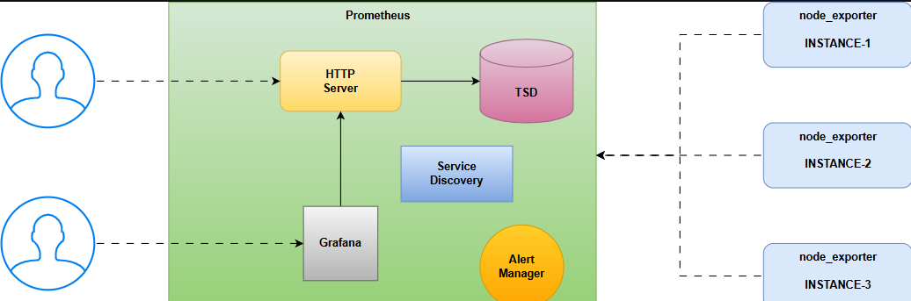

cd /opt
wget https://github.com/prometheus/prometheus/releases/download/v3.4.2/prometheus-3.4.2.linux-amd64.tar.gz
mv prometheus-3.4.2.linux-amd64.tar.gz prometheus

# creating systemctl service

[Unit]
Description=Prometheus Server
[Service]
ExecStart=/opt/prometheus/prometheus --config.file=/opt/prometheus/prometheus.yml
[Install]
WantedBy=multi-user.target

put above content into vi /etc/systemd/system/prometheus.service
Now you can start systemctl commands for prometheus ( start/enable)
Now open from localhost:9090

Now we install node_exporter on ec2 instances and scrape all the metrics from ec2 to main prometheus server dashboard
cd /opt
wget https://github.com/prometheus/node_exporter/releases/download/v1.9.1/node_exporter-1.9.1.darwin-amd64.tar.gz 
extract and rename to node_exporter as directory

# Create a systemctl file for node_exporter 

vi /etc/systemd/system/node_
[Unit]
Description=Node Exporter
[Service]
ExecStart=/opt/node_exporter/node_exporter
[Install]
WantedBy=multi-user.target

9100 is the port number for node_exporter

* add the ec2 node_exporter into prometheus.yaml file, so that it can scrape the metrics 

